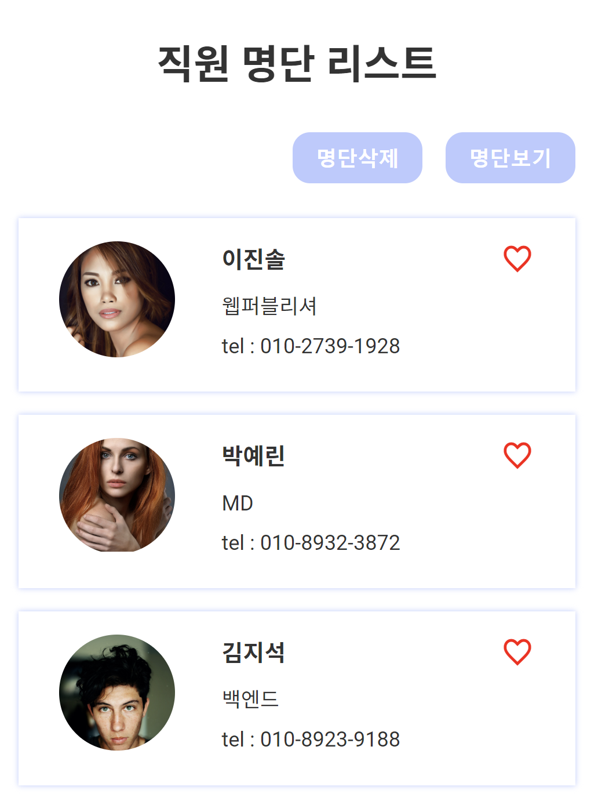
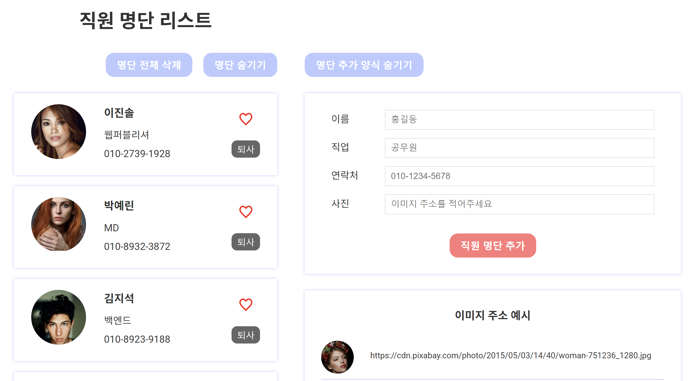

# 직원 명단 리스트 
직원의 이름, 직책, 사진 등의 간단 정보입력하여 명단 추가 기능 구현
직원 좋아요 표시, 직원삭제 기능 구현
localStorage를 이용한 로그인기능 구현

---
- Version1. Javascript + css : https://hajinkimm.github.io/peopleList/step7
- Version2. React + sass : https://hajinkimm.github.io/peopleList/step8_react/dist/
- Version3. React_Redux : https://hajinkimm.github.io/peopleList/step9_react-redux/dist/
---
- 최종 결과물

---

## # 목차
1. Version1 : Javascript + css
   1. __Step1__ 
      - vanilla script로 code작성 
      - index.html에 css, script 모두 작성한 기본 유형
   2. __Step2 (module)__ 
      - style.css파일에 css코드 분리
      - app.js파일에 javascript코드 분리
      - module폴더에 app.js내용 중 직원 명단 데이터 배열 data.js에 분리
   3. __Step3 (module)__
       -  module폴더에 app.js내용 중 ul생성 함수코드 showtxt.js에 분리
   4. __Step4 (module)__
      - module폴더에 app.js내용 중 하트색상 변경 코드 heart.js에 분리
   5. __Step5 (html변경 및 기능추가)__ 
      - 직원 명단을 추가할 수 있는 버튼과 기능 구현
      - localStorage 를 이용하여 데이터 저장 및 유지 가능
   6. __Step6 (class함수)__ 
      - Step5의 vanilla script로 작성된 code를 class함수로 변경
   7. __Step7 (module)__
      - Step6파일 module
2. Version2 : React + sass
   1. __Step8__
      - Step7을 React + sass로 리팩토링
3. Version3 : React + sass
   1.  __Step9__
       - Step8을 React Redux로 리팩도링
       - Layout 구조 사용
       - localStorage를 이용한 로그인기능 구현
       - 로그인 후에만 도서 추가, 수정 삭제 가능
---
# 1. Step1
## 1.1 파일
- index.html 문서 안에 script,css 코드를 모두 작성한 기본 유형 

    html | css |
    |:---:|:---:|
    indext.html|reset.css|
## 1.2 화면 출력
- 결과물
  
    
## 1.3 code 설명 및 javascript 기능 
 1. 직원 명단 데이터를 배열로 만들고 ul태그를 생성하여 출력내용에 데이터를 작성 후 명단 리스트를 출력
    ```javascript
    const obj = [
        {name:'이진솔', job: '웹퍼블리셔', tel: '010-2739-1928', imgUrl:'https://cdn.pixabay.com/photo/2016/01/18/05/09/woman-1146038_1280.jpg'},
            ...
    ]
    ```
    ```javascript
    function showtxt () {
        let listUl = document.createElement('ul')
        listUl.setAttribute('class', 'list')
        obj.forEach(ele=>{
            listUl.innerHTML += `<li>
            <div class="pic">
            
            </div>
            <div class="txt">
            <strong>${ele.name}</strong>
            <span>${ele.job}</span>
            <span>tel : ${ele.tel}</span>
            </div>
            <i class="xi-heart-o"></i>
            </li>`
        })
        conbox.append(listUl);
    }
    ```
1. [명단삭제 버튼] 생성되어 있는 ul태그를 제거하여 직원 명단 리스트가 전부 삭제 가능
    ```javascript
    btnDel.addEventListener('click',e=>{
        let listUl = document.querySelector('.list')
        if(listUl !== null){
            listUl.remove()
        }
        isshow = false;
    })
    ```
2. [명단보기 버튼] ul태그가 재생성되어 직원 명단 리스트가 전부 복구 가능
    ```javascript
    btnShow.addEventListener('click',e=>{
        if(isshow === false){
            showtxt();  
            heart();
            isshow = true;
        }
    })
    ```
3. [하트] 하트색이 채워지게 변경하여 직원 구분 가능
    ```javascript
    function heart(){
        const heartCol = document.querySelectorAll('.list li i');
        heartCol.forEach(ele=>{
            ele.addEventListener('click',e=>{
                let current = e.currentTarget
                if(current.classList.contains('xi-heart-o')){
                    current.setAttribute('class','xi-heart')
                }else{
                    current.setAttribute('class','xi-heart-o')
                }
            })
        })
    }
    ```

---
# 2. Step2
## 2.1 파일
  - style.css파일에 css코드 분리
  - app.js파일에 javascript코드 분리
  - module폴더에 app.js내용 중 직원 명단 데이터 배열 data.js에 분리

    html | css | js |
    |:---:|:---:|:---:|
    indext.html|reset.css| app.js 
    -|style.css| data.js (module)
## 2.2 변경 code
- index.html
    ```html
    <link rel="stylesheet" href="../css/style.css">
        ...
    <script type="module" src="./js/app.js"></script>
    ```
- app.js 
    ```javascript
    import {obj} from './module/data.js'
        ...
    ```
- data.js (module) 
    ```javascript
    export const obj = [
        {name:'이진솔', job: '웹퍼블리셔', tel: '010-2739-1928', imgUrl:'https://cdn.pixabay.com/photo/2016/01/18/05/09/woman-1146038_1280.jpg'},
            ...
    ]
    ```
---
# 3. Step3
## 3.1 파일
- module폴더에 app.js내용 중 ul생성 함수코드 showtxt.js에 분리

    html | css | js |
    |:---:|:---:|:---:|
    indext.html|reset.css| app.js 
    -|style.css| data.js (module)
    -|-|showtxt.js (module)
## 3.2 변경 code
- app.js   
    ```javascript
    import {obj} from './module/data.js'
    import {showtxt} from './module/showtxt.js'
        ...
    ```
- showtxt.js (module)
    ```javascript
    export function showtxt (conbox, obj) {
        let listUl = document.createElement('ul')
            ...
        conbox.append(listUl);
    }
    ```
---
# 4. Step4
## 4.1 파일
  - module폴더에 app.js내용 중 하트색상 변경 코드 heart.js에 분리

    html | css | js |
    |:---:|:---:|:---:|
    indext.html|reset.css| app.js 
    -|style.css| data.js (module)
    -|-|showtxt.js (module)
    -|-|heart.js (module)
## 4.2 변경 code
- app.js   
    ```javascript
    import {obj} from './module/data.js'
    import {showtxt} from './module/showtxt.js'
    import {heart} from './module/heart.js'
        ...
    ```
- heart.js (module)
    ```javascript
    export function heart(){
        const heartCol = document.querySelectorAll('.list li i');
            ...
    }
    ```
---
# 5. Step5
## 5.1 파일
   - 직원 명단을 추가할 수 있는 버튼과 기능 구현
  - localStorage 를 이용하여 데이터 저장 및 유지 가능

    html | css | js |
    |:---:|:---:|:---:|
    indext.html|reset.css| app.js 
    -|style.css| -
## 5.2 화면 출력
- 결과물 
  
    
## 5.3 code 설명 및 javascript 기능 
1. [명단 전체 삭제 버튼] localStorage에 저장된 데이터를 모두 제거
    ```javascript
    btnDel.addEventListener('click',e=>{
        let obj = JSON.parse(localStorage.getItem("obj"));
        obj = obj.filter(item => item.id===obj.id);
        localStorage.setItem("obj", JSON.stringify(obj));
        showtxt();
    })

    ```
2. [퇴사 버튼] id값을 이용하여 해당 데이터 삭제
    ```javascript
    const resiBtn =(resignBtn, id) =>{
        resignBtn.addEventListener('click',e=>{
            let obj = JSON.parse(localStorage.getItem("obj"));
            obj = obj.filter(item => item.id !== id);
            localStorage.setItem("obj", JSON.stringify(obj));
            showtxt();
        })
    }

    ```
3. [직원 명단 추가 버튼] 
    ```javascript
    const add = () =>{
        let obj = JSON.parse(localStorage.getItem("obj")) || [];
        let num = 0;
                if(obj.length !== 0){
                    num = obj[obj.length-1].id
                }
        num++;
        localStorage.setItem("num",JSON.stringify(num));
        num = JSON.parse(localStorage.getItem("num"));
        obj = [
            ...obj, 
            {id:num, name: userName.value, job: userJob.value, tel: userTel.value, imgUrl: userImg.value, islike:false},
        ]
        localStorage.setItem("obj",JSON.stringify(obj));
    }
    ```
3. [명단 추가 양식 숨기기 버튼] 버튼 아래의 내용들을 display : none 처리
    ```javascript
    addshowBtn.addEventListener('click',e=>{
        if(isadd){
            addWrap.style.display="none"
            addshowBtn.textContent = '명단 추가 양식 보이기'
        }else{
            addWrap.style.display="block"
            addshowBtn.textContent = '명단 추가 양식 숨기기'
        }
        isadd = !isadd
    })
    ```
---
# 6. Step6
## 6.1 파일
- vanilla script로 작성된 code를 class함수로 변경

    html | css | js |
    |:---:|:---:|:---:|
    indext.html|reset.css| app.js 
    -|style.css| -
## 6.2 변경 code
- class 함수를 사용하여 class TodoList 생성
    ```javascript
    class Staff{
        constructor(uName, uJob, uTel, uImg){
            this.uName = uName
            ...
        }
    }

    class StaffUI{
        ...
    }

    class LocalData{
        static getData(){
            obj = JSON.parse(localStorage.getItem("obj")) || [];
        }
    }
        ...
    ```
---
# 7. Step7
## 7.1 파일
- module 작업

    html | css | js |
    |:---:|:---:|:---:|
    indext.html|reset.css| app.js 
    -|style.css| getEle.js (module)
    -|-| listHide.js (module)
    -|-| staff.js (module)
    -|-| staffUI_local.js (module)
## 7.2 변경 code
- app.js (초기 실행, 명단 추가 기능)
    ```javascript
    import {get, getAll} from './module/getEle.js'
    import Staff from './module/staff.js'
    import {hide} from './module/listHide.js'
    import {StaffUI, LocalData} from './module/staffUI_local.js'

    ;(()=>{
        const btnShow = get('.btnShow');
        const addshowBtn = get('.addshowBtn');
        ...
        
        //초기실행
        StaffUI.first();
        LocalData.getData();
        LocalData.showData();
        hide(btnShow,addshowBtn,addWrap)

        //명단추가
        form.addEventListener('submit', e => {
            e.preventDefault();
            const uName = userName.value
            const uJob = userJob.value
            const uTel = userTel.value
            const uImg = userImg.value
            const staff = new Staff(uName, uJob, uTel, uImg)
            StaffUI.add(staff);
            LocalData.showData();
            StaffUI.reset();
        })
    }) ();  
    ```
- getEle.js
    ```javascript
    export const get = target => {
        if (document.querySelector(target)) {
            return document.querySelector(target);
        } else {
            throw 'ERROR - get';
        }
    };
    export const getAll = target => {
        if (document.querySelectorAll(target)) {
            return document.querySelectorAll(target);
        } else {
            throw 'ERROR - get';
        }
    };
    ```
- listHide.js (명단 숨기기&보이기 버튼)
    ```javascript
    let isshow=true;
    let isadd=true;
    let con = document.querySelector('.con')

    export const hide = (btnShow,addshowBtn,addWrap) =>{
        btnShow.addEventListener('click',e=>{
            if(isshow){
                con.style.display="none"
                btnShow.textContent='명단 보이기'
            }else{
                con.style.display="block"
                btnShow.textContent='명단 숨기기'
            }
            isshow = !isshow
        })
        addshowBtn.addEventListener('click',e=>{
            ...
        })
    }
    ```
- staff.js (직원 명단 추가 입력값 받아오는 함수)
    ```javascript
    class Staff{
        constructor(uName, uJob, uTel, uImg){
            this.uName = uName
            this.uJob =uJob
            this.uTel = uTel
            this.uImg = uImg
        }
    }
    export default Staff;
    ```
- staffUI.js (초기 데이터값, 화면출력, localStorage데이터 저장&불러오기)
    ```javascript
    let obj = [
        {id:1, name: '이진솔', job: '웹퍼블리셔', tel: '010-2739-1928', imgUrl: 'https://cdn.pixabay.com/photo/2016/01/18/05/09/woman-1146038_1280.jpg',islike:false },
            ...
    ]

    class StaffUI{
        static add (item){
            ...
        }
        ...
    }

    class LocalData{
        static getData(){
            obj = JSON.parse(localStorage.getItem("obj")) || [];
        }
        ...
    }

    export {StaffUI, LocalData}
    ```

# 8. Step8
## 8.1 파일
- 파일구조


# 9. Step9
## 9.1 파일
- 파일 구조


- 결과물


## 9.2 변경 code
- 비밀번호는 임의로 1234로 지정하였으며 1234를 입력했을 경우에만 로그인 가능 및 id만 localStorage에 저장<br>(로그아웃 시 localStorage에서 id 삭제)
    ```javascript
    login(state, action){
        const {email, password} = action.payload
        const userLog = {
            email
        }
        if(password === '1234'){
            state.staffathority = {email, password}
            localStorage.setItem('userLog', JSON.stringify(userLog))
        }
    },
    logout(state, action){
        state.staffathority = null
        localStorage.removeItem('userLog')
    }
    ```